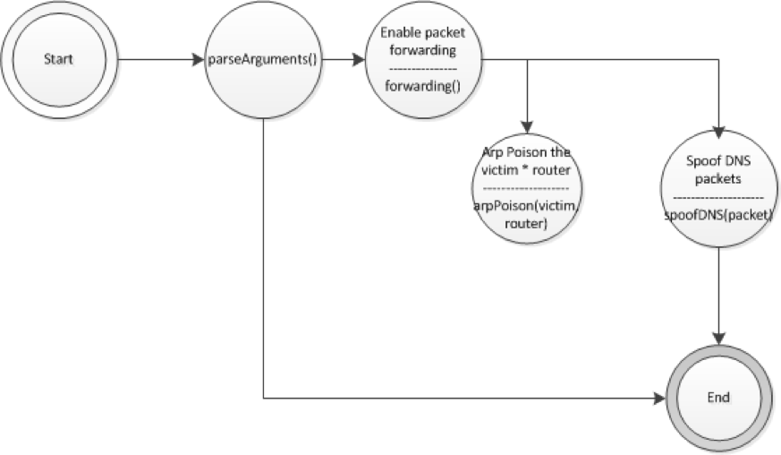
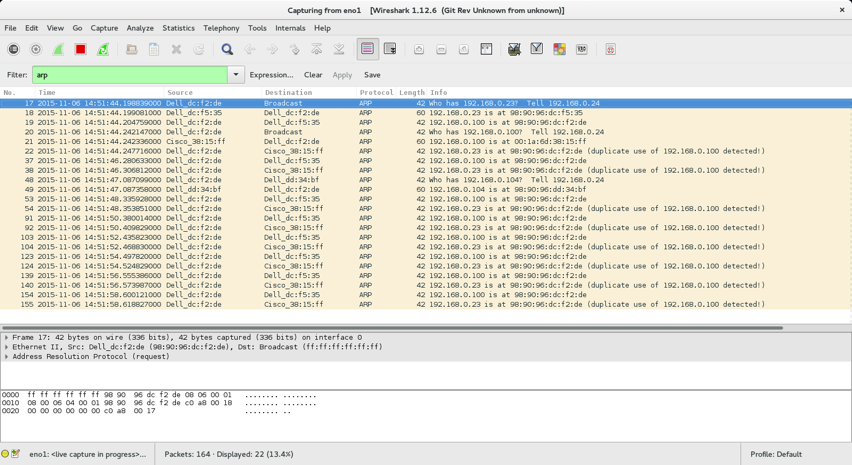
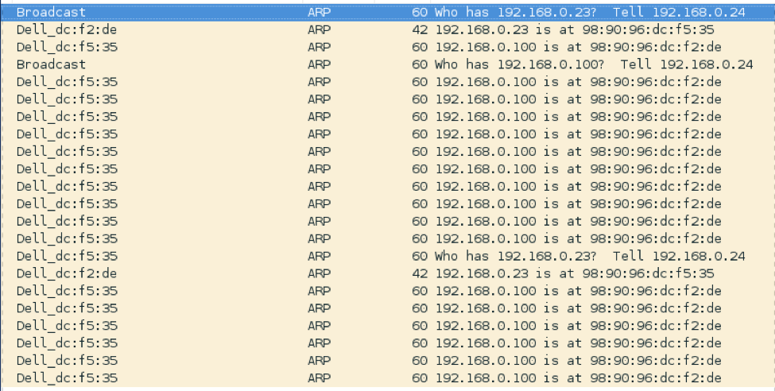
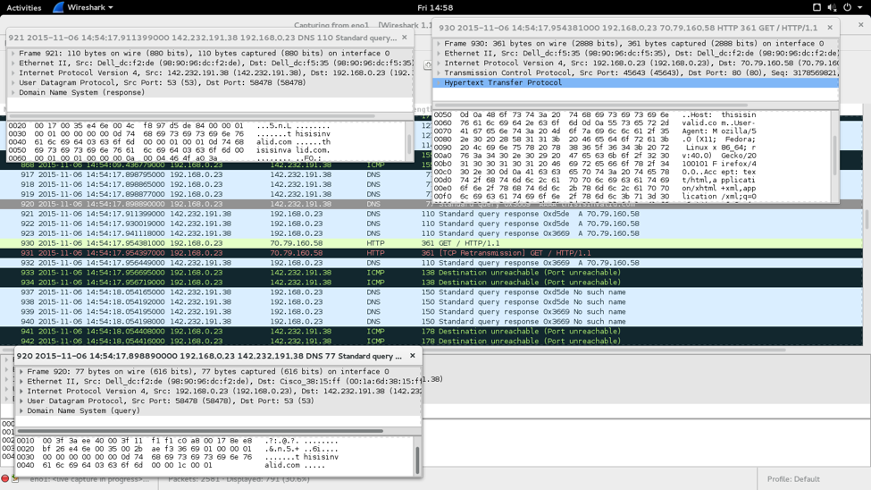
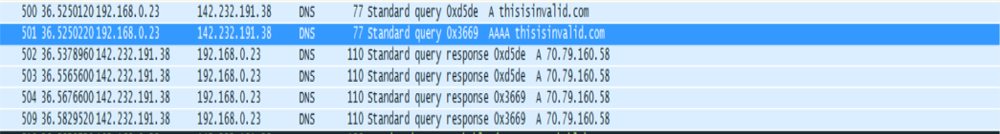
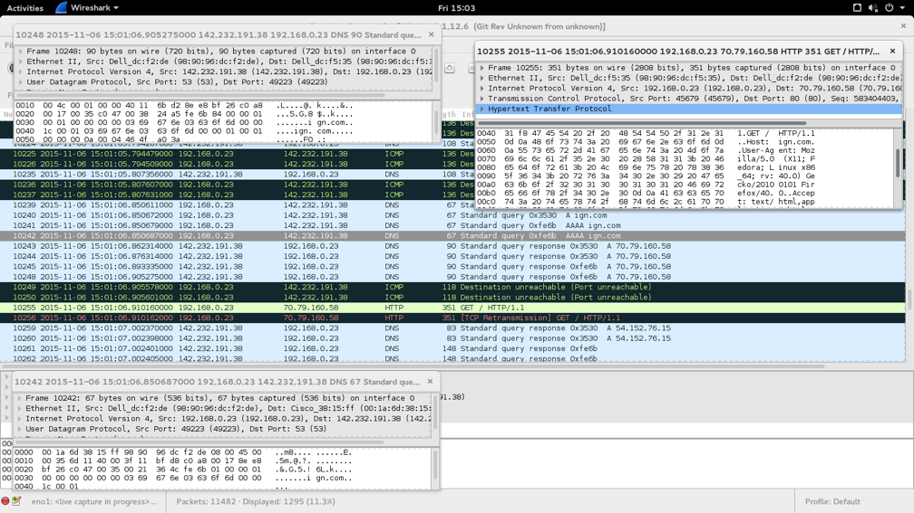
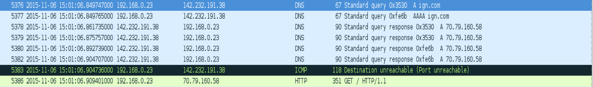
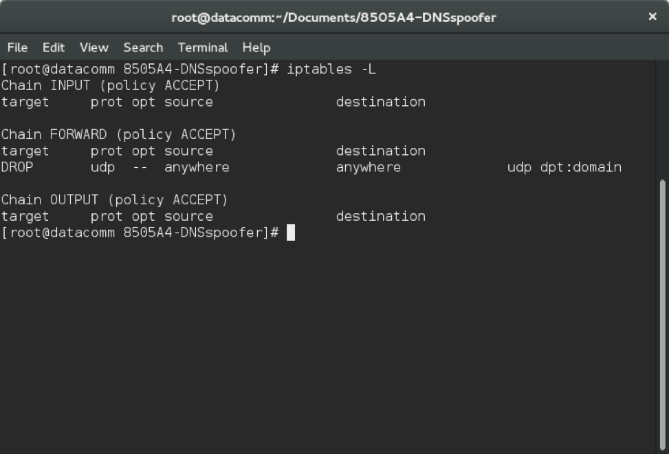
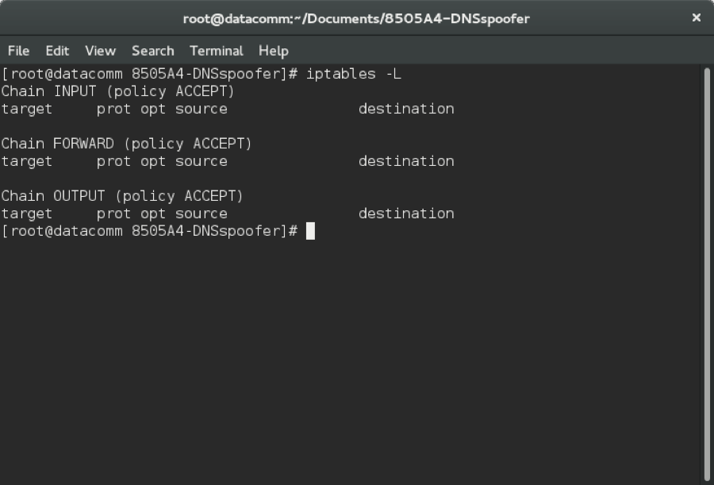

**Thilina Ratnayake**

**Elton Sia**

**COMP 8505**

Introduction
============

DNSspoofer is an application that (1) intercepts traffic by performing a
man-in-the-middle attack through the use of ARP poisoning, and then (2)
replies to all DNS queries with a desired IP.

Features:
---------

Some features of the Backsniffer suite include:

-   **Target Specific ARP poisoning:**\
    The attacker is able to leave a low foot print when performing the
    MITM attack by only sending ARP requests/replies to the victim
    and router.

-   **Automatic MAC address gathering\
    **DNSspoofer automatically gathers the MAC addresses of the target
    and victim through initial pings.

-   **Automatic Forwarding Rules\
    **DNSspoofer automatically triggers firewall rules to (1) enable
    forwarding of packets from the victim to the router, and (2) drop
    any DNS outgoing forwarded packets from the DNS to ensure that the
    router never gets anything from the victim.

-   **Mass DNS replies\
    **Every DNS query sent by the client is provided a crafted reply.

-   **Dynamic (runtime specified) redirection IP’s\
    **The attacker can choose which IP the DNS replies should direct to
    at runtime.

Practical Application & Use-Case
--------------------------------

A typical scenario for this application would be in utilizing a social
engineering vector to initiate an attack.

For example, if a victim was utilizing a Wireless LAN (such as in a
coffee-shop), the attacker can use DNS spoofer to redirect the victim to
a compromised page (perhaps one that contains a “Wi-Fi splash page”
similar to the branding of the organization) that will prompt the victim
to download an exploit.

Usage
=====

Requirements:
-------------

1.  DNSspoofer requires that the following python libraries be
    installed:

    a.  Scapy: “Scapy is a powerful interactive packet
        manipulation program. It is able to forge or decode packets of a
        wide number of protocols, send them on the wire, capture them,
        match requests and replies, and much more. It can easily handle
        most classical tasks like scanning, tracerouting, probing, unit
        tests, attacks or network discovery (it can replace hping, 85%
        of nmap, arpspoof, arp-sk, arping, tcpdump, tethereal,
        p0f, etc.). It also performs very well at a lot of other
        specific tasks that most other tools can't handle, like sending
        invalid frames, injecting your own 802.11 frames, combining
        technics (VLAN hopping+ARP cache poisoning, VOIP decoding on WEP
        encrypted channel, ...), etc. “

2.  This can be installed by running the command:

    a.  Pip install scapy**\
        **

Executing the attack
--------------------

*Starting the DNS spoofer.\
*DNSspoofer expects a command in the following format:\
python dnsspoof.py -v 192.168.0.10 -r 192.168.0.1 -o 192.168.0.3 -g
70.79.160.58\
where:

-   -v expects IP address of the victim (target) machine

-   -r expects the IP address of the router

-   -o expects the IP address of the local machine

-   -g is the IP the client should be sent to.

Once the command is entered, the following will occur:

1.  DNSspoofer will send pings to the router and victim machine to
    obtain the MAC addresses.

2.  Once it has received the MAC addresses, it will perform a MITM
    attack by arp poisoning the router & victim to make them believe
    that each other exists at the local IP of the attackers machine.

3.  Once a MITM connection has been established, all DNS queries sent
    from the victim will be sent a response directing them to the IP
    specified to the –o flag at runtime.

Results
=======

After running tests and experiments, the results show that DNSspoofer is
able to:

-   ARP poison the router & victim to establish a MITM connection

-   Respond to all DNS queries with the IP specified by the client.

Diagrams 
=========

### Finite State Machine

Code Listings
=============

DNSspoofer exists in one file:

1.  DNSspoofer.py

Psuedocode
==========

### Dnsspoof.py

1.  Parse arguments (victimIP, routerIP,ownIP,gotoIP)

2.  Get all the details in preparation for ARP poisoning

    a.  Get the victim’s MAC address

    b.  Get the router’s MAC address

    c.  Get the local machine’s own MAC address

3.  Enable IP forwarding to allow packets originating from source, out
    to router.

4.  Trigger a firewall rule to drop all DNS queries originating
    from victim.

5.  Perform ARP poisoning

6.  Sniff for DNS queries originating from client

7.  For any DNS query, respond with a record directing the victim to the
    IP specified.

Tests
=====
| # | Name                              | Resource    | Expected                                              | Actual      | Result | Figure        |
|---|-----------------------------------|-------------|-------------------------------------------------------|-------------|--------|---------------|
| 1 | Arp Poison                        | Dnsspoof.py | Arp poison the router and the victim machine          | As Expected | Pass   | 1.1, 1.2      |
| 2 | DNS Spoofing with invalid website | Dnsspoof.py | Victim connects to website specified by attacker      | As Expected | Pass   | 2.1, 2.2, 2.3 |
| 3 | DNS Spoofing with valid website   | Dnsspoof.py | Victim connects to website specified by attacker      | As Expected | Pass   | 3.1, 3.1, 3.3 |
| 4 | Enable firewall                   | Dnsspoof.py | Drop forwarding packets to the router from the victim | As Expected | Pass   | 4.1           |
| 5 | No firewall rule                  | Dnsspoof.py | No added firewall rule to drop packets to the router  | As Expected | Pass   | 5.1           |

Figures & Tests
===============

***Test 1 – Arp Poisoning***

Figure 1.1: Wireshark showing the ARP packets from the attacker machine

Figure 1.2: Wireshark showing the ARP packets from the victim machine

***Test 2 – DNS Spoofing With An Invalid Website***

Figure 2.1: Wireshark from the attacker showing the process when
redirecting the victim to the specified website

Figure 2.2: Wireshark from victim showing that victim is trying to
access an invalid website

Figure 2.3: Victim accessing an invalid website (It does not exist) and
gets redirected to our website

 

***Test 3 – DNS Spoofing With A Valid Website***

Figure 3.1: Wireshark from attacker showing the process of the victim’s
connection to a valid website (www.ign.com)

Figure 3.2: Wireshark from victim showing the connection to a valid
website ([www.ign.com](http://www.ign.com))

Figure 3.3: Victim accessing a valid website but gets redirected to our
specified website

***Test 4 – DNS Spoofing With A Firewall Rule That Drops DNS Queries***

Figure 4.1: Testing with Firewall that drops packets from victim machine
to the router

***Test 5 – DNS Spoofing With No Firewall Rules***

Figure 5.1: Testing with no extra firewall rule

